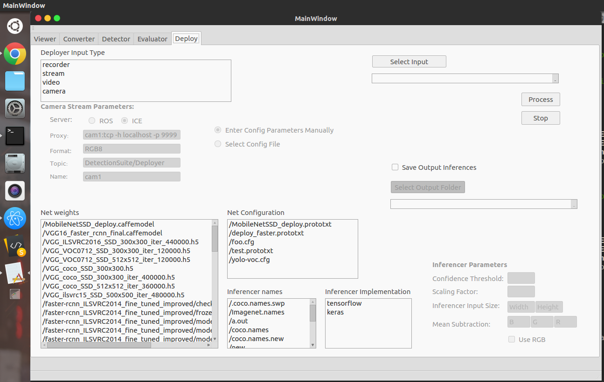

This tool makes inferences using images from different sources. Having the input, the user provides the weights and several configuration parameters
and pressing **Process**, a new window pops up showing the images with the inferences in real time.



Several inferencers and input sources are supported. This functionality is only available in the GUI mode.


To run it navigate to ``` DatasetEvaluationApp/build``` and run

```
    ./DatasetEvaluationApp -c appConfig.yml 
```

The inferences obtained can be written to a file providing it before executing and a threshold confidence 
limit can be set, so a detection is only considered if the confidence is over the threshold.

## 1. Input Images
In order to run inferences, a user needs input images. they can be captured from multiple resources:

* ### 1.2. Video
To use video select the corresponding video file using **Select Input**.

* ### 1.3. Camera
Simply select the **camera** option and it will automatically select a camera.

* ### 1.4. Stream
Currently, DetectionSuite supports ROS (Robot Operating System) and ICE (Internet Communication Engine) for reading streams,
and both of them are optional dependencies and required only if you plan to use one of them.
After selecting **stream**, you can choose between the following:

   * ### 1.4.1. ROS
        To use ROS, just select ROS from Inferencer Implementation Params, and enter the corresponding params for it
        If you have a *.yaml* file containing params, you can select it instead.

   * ### 1.4.2. ICE
        Similarly, for ICE just select it and enter the corresponding params or a *.yaml* file as you please.

**Note:** If you find any one of the above disabled then, it isn't probably installed or you DetectionSuite didn't find it.

## 2. Network
As any other tool, you would need a network to infer, on any one of the supported frameworks. Just fill up the following parameters,
to let DetectionSuite know more about the Inferencer.
    
   * ### 2.1. Net weights:
        Select the Network's Weights file. It would be *.pb* (frozen inference graph) for TensorFlow, 
        *.h5* for Keras, *.caffemodel* for Caffe, *.weights* for Darknet and .pth for PyTorch.
   * ### 2.2. Net configuration file:
        Configuration files aren't necessary for TensorFlow and Keras (any empty file would suffice), but for Darknet would need ```.cfg```, for Caffe a ```.prototxt``` file and for PyTorch a ```.yml```.
   * ### 2.3. Inferencer names (or network class names):
        These are the class names on which the deep learning network was trained on. So, a file containing a list of class names in the correct order.
        See [datasets](../class_names/) for some class names file.
   * ### 2.4. Inferencer implementation (framework being used):
        Currently support Darknet, TensorFlow, PyTorch, Keras and Caffe.  

**Note:** For Caffe, you might need to add some additional parameters specific to your model. Some samples are available at our [model zoo](../../resources/model_zoo/).
   
After configuring all these parameters, you are good to go.  
  
Also, all these parameters at once might seem scary and tedious to configure, but after you launch the GUI it will seem quite easy
and almost all of them are self-explanatory.