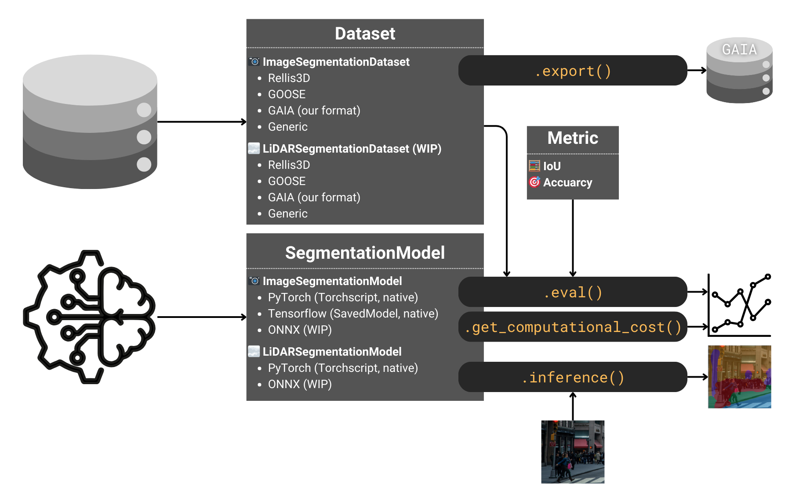

>&#9888;&#65039; ***DetectionMetrics v1*** website referenced in our *Sensors* paper is still available [here](https://jderobot.github.io/DetectionMetrics/v1)

# What is DetectionMetrics?
*DetectionMetrics* is a family of toolkits designed to unify and streamline the evaluation of perception models across different frameworks and datasets. Looking for our published ***DetectionMetrics v1***? Check out all the [relevant links](#v1) below.

Now, we're excited to introduce ***DetectionMetrics v2***! While retaining the flexibility of our previous release, *DetectionMetrics* has been redesigned with an expanded focus on image segmentation, with plans to extend support to object detection and LiDAR applications. As we move forward, *v2* will be the actively maintained version, featuring continued updates and enhancements to keep pace with evolving AI and computer vision technologies.

<table style='font-size:100%'>
  <tr>
    <th>&#128187; <a href="https://github.com/JdeRobot/DetectionMetrics">Code</a></th>
    <th>&#128295; <a href="https://jderobot.github.io/DetectionMetrics/v2/installation">Installation</a></th>
    <th>&#129513; <a href="https://jderobot.github.io/DetectionMetrics/v2/compatibility">Compatibility</a></th>
    <th>&#128214; <a href="https://jderobot.github.io/DetectionMetrics/py_docs/_build/html/index.html">Docs</a></th>
  </tr>
</table>



# What's supported in DetectionMetrics

<table><thead>
  <tr>
    <th>Task</th>
    <th>Modality</th>
    <th>Datasets</th>
    <th>Framework</th>
  </tr></thead>
<tbody>
  <tr>
    <td rowspan="2">Segmentation</td>
    <td>Image</td>
    <td>Rellis3D, GOOSE, custom GAIA format</td>
    <td>PyTorch, Tensorflow</td>
  </tr>
  <tr>
    <td>LiDAR</td>
    <td>Coming soon</td>
    <td>Coming soon</td>
  </tr>
  <tr>
    <td>Object detection</td>
    <td>Image</td>
    <td>Check <a href="https://jderobot.github.io/DetectionMetrics/v1"><i>DetectionMetrics v1</i></a></td>
    <td>Check <a href="https://jderobot.github.io/DetectionMetrics/v1"><i>DetectionMetrics v1</i></a></td>
  </tr>
</tbody>
</table>

More details in the [Compatibility](/v2/compatibility) section.

# DetectionMetrics v1
{: #v1}

Our previous release, ***DetectionMetrics v1***, introduced a versatile suite focused on object detection, supporting cross-framework evaluation and analysis. [Cite our work](#cite) if you use it in your research!

<table style='font-size:100%'>
  <tr>
    <th>&#128187; <a href="https://github.com/JdeRobot/DetectionMetrics/releases/tag/v1.0.0">Code</a></th>
    <th>&#128214; <a href="https://jderobot.github.io/DetectionMetrics/v1">Docs</a></th>
    <th>&#128011; <a href="https://hub.docker.com/r/jderobot/detection-metrics">Docker</a></th>
    <th>&#128240; <a href="https://www.mdpi.com/1424-8220/22/12/4575">Paper</a></th>
  </tr>
</table>

# Cite our work
{: #cite}

```
@article{PaniegoOSAssessment2022,
  author = {Paniego, Sergio and Sharma, Vinay and Cañas, José María},
  title = {Open Source Assessment of Deep Learning Visual Object Detection},
  journal = {Sensors},
  volume = {22},
  year = {2022},
  number = {12},
  article-number = {4575},
  url = {https://www.mdpi.com/1424-8220/22/12/4575},
  pubmedid = {35746357},
  issn = {1424-8220},
  doi = {10.3390/s22124575},
}
```